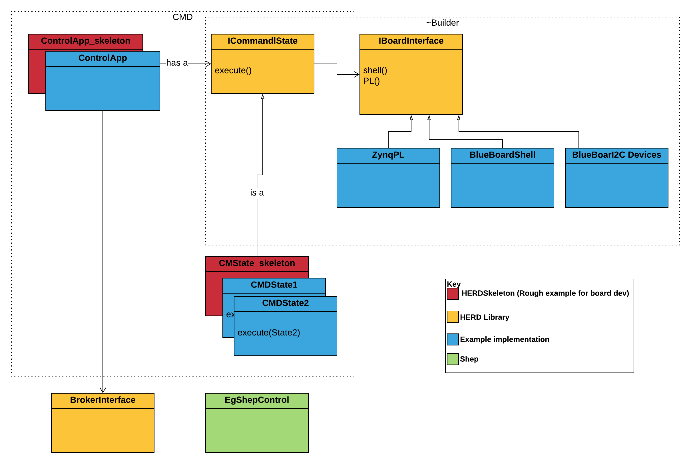

#  Library

This repo contains the core source for use in both provided  applications and externally created applications.  The HERD libary intends to provide reusable operational code for use in CMS Tracker custom control PCBs utilising an onboard ARM processor.  In the majority of these board it is expected that this processor is a Xilinx Zynq.  As such support for accessing the programmable logic within Zynq ICs is included but this library will operate on non-Zynq platforms too.

**Key functionality provided by use of HERDlib enables:**
* Common tooling across SoC boards
    - Common debug interface and tools
    - Common monitoring GUI
    - Common integration with Central DAQ
    - Common command type
    - 
    
**Overview**

## Provided  Applications using HERDlib include:
1. [Control_Skeleton(./Skeletons/ControlApp_Skeleton.cpp)
2. [CommandLine]()
3. [Monitor]()

## HERDlib dependancies
- gtest
- liblog4cplus
- libboost-regex
- libboost-thread
- libboost-chrono
- ZeroMQ
- yamlcpp

## Gettiing started (User): Trying HERDlib out
The easiest way to start working with  is to use the prebuild development docker image.  The following assumes you have docker installed.

```
$ docker pull rknowlton/shepherd-dev:latest
$ docker run -i -t rknowlton/shepherd-dev:latest /bin/bash
```
We reccommend experimenting with 1 of the example applications provided. CommandLine is mostly easily deployed on a server or laptop, see [CommandLineExamples]().

Alternatively, the CommandLine application can also be deployed on a zynq processor by:
1. Running BalenaOS and following [ CommandLine Balena instructions]().
2. Manually installing it via [ COmmandLine manual install instructions]()

## Getting Started (Developer)
HERDlib uses:
 * [Google Test](https://github.com/google/googletest) 
 * [Google C++ Style guide](https://google.github.io/styleguide/cppguide.html).  
 * Documentation is generated using [Doxygen](http://doxygen.nl/).
 * And is developed under a **???? license**

### Developing using a preconfigured docker image

### Developing on Redhat/CENTOS

### Developing on Ubuntu/Debian

### Building from source
```
$ mkdir build
$ cd build
$ cmake ..
$ make
```

## Documentation
To generate the docs locally: 

**Ubuntu**
```
$ sudo apt-get install doxygen graphviz
$ cd docs
$ doxygen
```
Open a web browser and navigate to ./docs/html/index.html

**CENTOS7**
```
$ sudo yum install doxygen graphviz
$ cd docs
$ doxygen
```

Open a web browser and navigate to ./docs/html/index.html

**OSX**

**Windows**

## Contributing

**Pull requests and issues are welcome**


